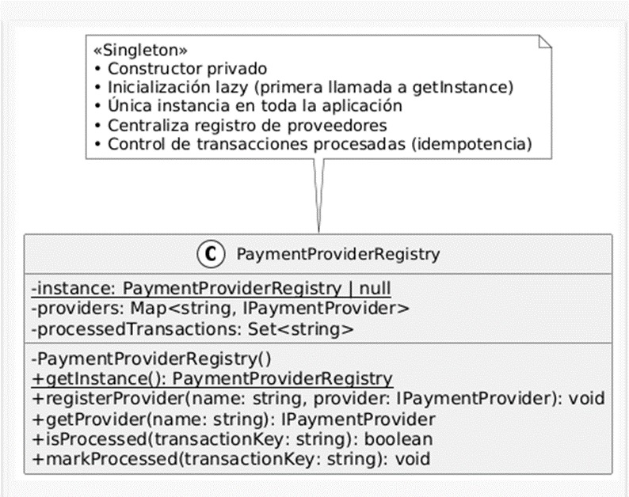
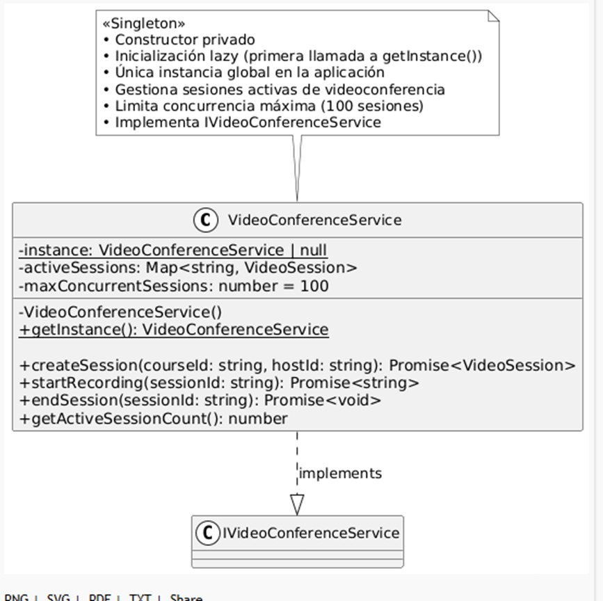
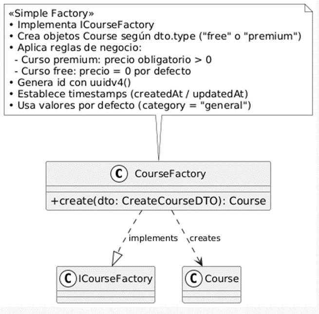
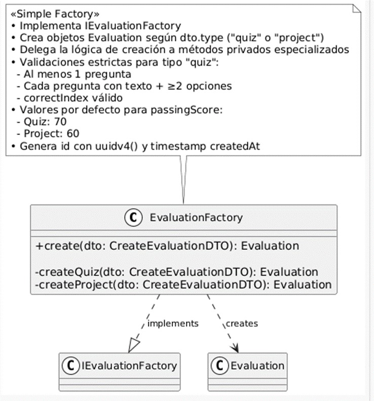

# Curso de Patrones de Software  
## Taller Semana 4  

### Aplicación del patrón Singleton, Factory Method y Abstract Factory

**Integrantes:**  
- Daniel Andrés Bohórquez Bolivar  
- Daniel Enrique Hernández De La Cruz  

**Docente:**  
Doc. Eliecer Montero Ojeda  

---

## 1.1	Payment Provider Registry

```ts
private static instance: PaymentProviderRegistry | null = null;

private constructor() {} // Constructor privado

public static getInstance(): PaymentProviderRegistry {
    if (!PaymentProviderRegistry.instance) {
        PaymentProviderRegistry.instance = new PaymentProviderRegistry();
    }
    return PaymentProviderRegistry.instance;
}
```

Se tiene en cuenta lo siguiente al implementarse el patrón
-	Implementación del patrón Singleton.
-	Garantiza que solo exista una única instancia de PaymentProviderRegistry en toda la aplicación,
-	centralizando el registro y consulta de proveedores de pago, así como el control de transacciones ya procesadas.
-	Se utiliza inicialización diferida (lazy initialization).-

Razón principal para usar Singleton aquí: Garantizar que exista una única instancia que centralice y coordine todos los proveedores de pago registrados y el control de transacciones ya procesadas en toda la aplicación, evitando duplicados, inconsistencias o gasto innecesario de recursos al tener múltiples registros independientes.

## 1.2	Aplicación del patrón Sigleton en VideoconferenceService

```ts
private static instance: VideoConferenceService | null = null;

private constructor() { ... }

public static getInstance(): VideoConferenceService {
    if (!VideoConferenceService.instance) {
        VideoConferenceService.instance = new VideoConferenceService();
    }
    return VideoConferenceService.instance;
}
```

La clase VideoConferenceService utiliza el patrón Singleton clásico en su forma más común en TypeScript/JavaScript:

-	Constructor privado (private constructor())
-	Campo estático privado para la única instancia
-	Método estático getInstance() que hace lazy initialization
-	Siempre devuelve la misma instancia

*	Garantiza que exista **una única instancia** de **VideoConferenceService** en toda la aplicación,
*	centralizando la gestión de sesiones de videconferencia activas y limitando el número
*	máximo de sesiones concurrentes.

*	Uso: VideoConferenceService.getInstance() en lugar de new VideoConferenceService()

Mantener un único punto de control para todas las sesiones de videconferencia activas (incluyendo el conteo de sesiones concurrentes y el límite máximo), asegurando que el estado global (sesiones en curso, recursos limitados) sea consistente y no se creen múltiples gestores que puedan permitir exceder el límite o perder sincronía.

# Aplicación del Patrón Factory Method

##  1.1	Evaluation Factory

```ts
create(dto: CreateEvaluationDTO): Evaluation {
  if (dto.type === "quiz") {
    return this.createQuiz(dto);
  }
  return this.createProject(dto);
}
```

El Factory Method clásico requiere estos elementos clave:

Una clase creadora abstracta (o con método fábrica abstracto / virtual)
Subclases concretas que heredan de esa creadora
Cada subclase sobreescribe el método fábrica y decide qué tipo concreto retornar
El cliente usa la creadora abstracta → polimorfismo en la creación (subclases deciden)

Una clase dedicada solo a crear objetos (Evaluation)
Recibe parámetros (el DTO) y decide internamente qué variante crear (quiz vs project)
Encapsula validaciones y reglas de negocio específicas de cada tipo
Método público create() que actúa como punto único de creación

## 1.2	Course Factory

```ts
export class CourseFactory implements ICourseFactory {
  create(dto: CreateCourseDTO): Course {
    const now = new Date();
    const base = {
      id: uuidv4(),
      title: dto.title,
      description: dto.description,
      instructorId: dto.instructorId,
      category: dto.category || "general",
      createdAt: now,
      updatedAt: now,
    };

    if (dto.type === "premium") {
      if (!dto.price || dto.price <= 0) {
        throw new Error("Premium courses must have a price greater than 0");
      }
      return { ...base, type: "premium" as const, price: dto.price };
    }

    return { ...base, type: "free" as const, price: 0 };
  }
}
```

Centraliza toda la lógica de creación en un solo lugar
Aplica reglas de negocio claras (precio > 0 para premium, default category, timestamps, etc.)
Valida datos de entrada antes de construir
Devuelve siempre el mismo tipo (Course) pero con variantes internas (discriminadas por type)
Es muy fácil de usar desde cualquier parte: courseFactory.create(dto)

# Aplicación del Patrón Abstract Factory

## 1.1 ILMSContentFactory — Interfaz de Fábrica Abstracta

```ts
export type TierCourseInput = Omit<CreateCourseDTO, "type">;
export type TierEvaluationInput = Omit<CreateEvaluationDTO, "type">;
export type TierCertificateInput = Omit<GenerateCertificateInput, "type">;

export interface ILMSContentFactory {
  createCourse(input: TierCourseInput): Course;
  createEvaluation(input: TierEvaluationInput): Evaluation;
  createCertificate(input: TierCertificateInput): Certificate;
}
```

La interfaz `ILMSContentFactory` define el contrato del patrón Abstract Factory. Agrupa tres métodos de creación que producen una **familia coherente** de objetos del LMS según el nivel de suscripción del usuario.

Se tiene en cuenta lo siguiente al implementarse el patrón:
-	Define una interfaz para crear familias de objetos relacionados sin especificar sus clases concretas.
-	El campo `type` es omitido de los inputs mediante `Omit<DTO, "type">`, ya que la fábrica concreta es la responsable de determinarlo. Esto impide que el caller eluda la restricción del nivel de suscripción.
-	Ambas fábricas concretas implementan la misma firma de interfaz, permitiendo su uso de forma polimórfica.

## 1.2 FreeTierContentFactory — Fábrica Concreta (Nivel Gratuito)

```ts
export class FreeTierContentFactory implements ILMSContentFactory {
  constructor(
    private readonly courseFactory: ICourseFactory,
    private readonly evaluationFactory: IEvaluationFactory,
    private readonly certificateFactory: ICertificateFactory
  ) {}

  createCourse(input: TierCourseInput): Course {
    return this.courseFactory.create({ ...input, type: "free", price: 0 });
  }

  createEvaluation(input: TierEvaluationInput): Evaluation {
    return this.evaluationFactory.create({
      ...input,
      type: "project",
      passingScore: input.passingScore ?? 60,
    });
  }

  createCertificate(input: TierCertificateInput): Certificate {
    return this.certificateFactory.create({ ...input, type: "basic" });
  }
}
```

`FreeTierContentFactory` es la fábrica concreta para el nivel gratuito. Garantiza que todos los objetos creados sean coherentes con ese nivel:
-	**Cursos:** siempre de tipo `"free"` con `price = 0`.
-	**Evaluaciones:** siempre de tipo `"project"` con nota mínima aprobatoria de 60 por defecto.
-	**Certificados:** siempre de tipo `"basic"`.

Delega la construcción real a las fábricas individuales existentes (`CourseFactory`, `EvaluationFactory`, `CertificateFactory`) recibidas por inyección de dependencias en el constructor, respetando el principio de inversión de dependencias y el patrón ya establecido en el contenedor.

## 1.3 PremiumTierContentFactory — Fábrica Concreta (Nivel Premium)

```ts
export class PremiumTierContentFactory implements ILMSContentFactory {
  constructor(
    private readonly courseFactory: ICourseFactory,
    private readonly evaluationFactory: IEvaluationFactory,
    private readonly certificateFactory: ICertificateFactory
  ) {}

  createCourse(input: TierCourseInput): Course {
    return this.courseFactory.create({ ...input, type: "premium" });
  }

  createEvaluation(input: TierEvaluationInput): Evaluation {
    return this.evaluationFactory.create({
      ...input,
      type: "quiz",
      passingScore: input.passingScore ?? 80,
    });
  }

  createCertificate(input: TierCertificateInput): Certificate {
    return this.certificateFactory.create({ ...input, type: "verified" });
  }
}
```

`PremiumTierContentFactory` es la fábrica concreta para el nivel premium. Garantiza que todos los objetos creados sean coherentes con ese nivel:
-	**Cursos:** siempre de tipo `"premium"`. El precio debe ser mayor a 0; de lo contrario, `CourseFactory` lanza un error de validación.
-	**Evaluaciones:** siempre de tipo `"quiz"` con nota mínima aprobatoria de 80 por defecto.
-	**Certificados:** siempre de tipo `"verified"`.

## 1.4 Registro en el contenedor de dependencias

```ts
// ─── ABSTRACT FACTORIES (Content Tier Families) ──────
export const freeTierFactory = new FreeTierContentFactory(
  courseFactory,
  evaluationFactory,
  certificateFactory
);

export const premiumTierFactory = new PremiumTierContentFactory(
  courseFactory,
  evaluationFactory,
  certificateFactory
);
```

Ambas fábricas abstractas comparten las mismas instancias de las fábricas individuales ya construidas en el contenedor. Esto es seguro porque dichas fábricas son **sin estado** (no tienen variables de instancia mutables), por lo que compartir instancias no genera inconsistencias.

Razón principal para usar Abstract Factory aquí: garantizar que la familia completa de objetos creados (curso, evaluación, certificado) sea consistente con el nivel de suscripción del usuario, sin que el código cliente deba conocer ni controlar los tipos concretos de cada objeto. Una sola variable de tipo `ILMSContentFactory` es suficiente para crear objetos coherentes de toda la familia.

---

## Diagramas UML

### PaymentProviderRegistry



### VideoConferenceService



### CourseFactory




### EvaluationFactory

